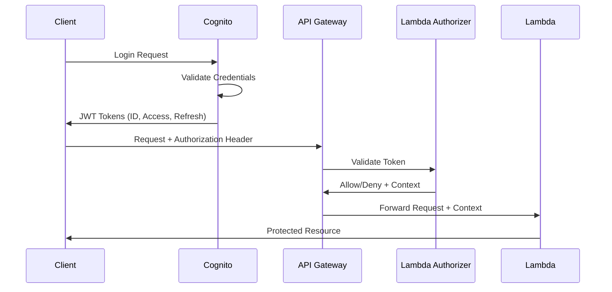

# Technology Stack and Security Standards

## AWS Services and Infrastructure

### AWS Control Tower Governance

The development environment exists within an AWS account managed by AWS Control Tower, providing:
- **Unified Governance**: Consistent policies across all organizational accounts
- **Security Guardrails**: Preventative and detective controls enforced organization-wide
- **Compliance Management**: Centralized compliance reporting and monitoring
- **Account Provisioning**: Standardized account creation with security controls
- **Auditing**: Cross-account activity logging and monitoring

AWS Control Tower ensures:
- Security best practices are automatically enforced
- Regulatory compliance requirements are met across all accounts
- Resources are deployed following organizational policies
- Violations are detected and remediated
- Security and compliance posture is continuously monitored

### Core AWS Services

1. **Amazon Cognito**
   - Primary authentication service
   - User pool configuration for client accounts
   - Identity pool for federated identities
   - Multi-factor authentication (MFA) requirement
   - Custom authentication flows for client integrations

2. **API Gateway**
   - RESTful API endpoints
   - API key management for partner integrations
   - Usage plans and throttling controls
   - API documentation with Swagger/OpenAPI
   - Custom domain mapping

3. **AWS Lambda**
   - Serverless handlers for all API endpoints
   - Node.js runtime environment
   - Memory optimization (512MB standard, 1024MB for integrations)
   - Environment-based configuration
   - Standard IAM role patterns

4. **Amazon SES**
   - Transactional email delivery
   - Email templates with handlebars
   - Delivery tracking and metrics
   - DKIM and SPF configuration
   - Bounce handling

5. **AWS CloudFormation**
   - Infrastructure as Code (IaC)
   - Stack-based deployment
   - Parameter Store integration
   - Environment separation
   - Resource tagging requirements

6. **Amazon RDS (PostgreSQL)**
   - Primary data store
   - Multi-AZ deployment
   - Performance Insights monitoring
   - Point-in-time recovery
   - Enhanced monitoring

7. **Amazon S3**
   - Secure file storage
   - Certificate storage
   - Lifecycle policies
   - Server-side encryption
   - Presigned URL pattern for secure access

## Security Architecture

### Authentication Flow



### Authorization Model

1. **Role-Based Access Control (RBAC)**
   - Super Admin: System-wide access
   - Client Admin: Client-scoped access
   - Integration Admin: Integration-scoped access
   - Company Admin: Company-scoped access
   - User: Feature-specific access

2. **Context-Based Authorization**
   - Company context required for company operations
   - Client context required for client operations
   - Integration context required for integration operations
   - Feature context required for feature operations

3. **Permission Structure**
   ```typescript
   interface Permission {
     resource: string;     // Resource identifier
     action: string;       // Action type (read, write, execute)
     scope: string;        // Scope of access (all, company, client)
     context?: string[];   // Required context fields
   }
   ```

### Data Security

1. **Data Classification**
   - Public: Publicly available information
   - Internal: Organization-only information
   - Confidential: Restricted information
   - Sensitive: Highly restricted information

2. **Encryption Requirements**
   - Data at rest: AES-256 encryption
   - Data in transit: TLS 1.2+
   - Database encryption: RDS encryption
   - File encryption: S3 server-side encryption
   - Secrets: AWS Secrets Manager

3. **PII Handling**
   - Minimize PII collection
   - Tokenization for sensitive data
   - Masking in logs and error messages
   - Audit trails for PII access
   - Retention policies for PII data

## Certificate Management

### X.509 Certificate Handling

1. **Certificate Storage**
   - Encrypted storage in S3
   - Access controlled via IAM
   - Short-lived presigned URLs for access
   - Metadata in database, content in S3

2. **Certificate Lifecycle**
   - Creation via self-service portal
   - Expiration monitoring and alerts
   - Automatic rotation capability
   - Historical tracking for audit

3. **Certificate Usage**
   - Authentication to external systems
   - Client API authentication
   - Secure communication between services
   - Identity verification

## Security Monitoring and Compliance

### Monitoring Architecture

1. **CloudWatch Logs**
   - Centralized logging
   - Log retention policy (30 days minimum)
   - Structured logging format
   - Log levels (ERROR, WARN, INFO, DEBUG)

2. **CloudTrail**
   - API activity monitoring
   - Management event logging
   - Data event logging for sensitive resources
   - Multi-region trail configuration

3. **Security Alerting**
   - Failed authentication alerts
   - Suspicious activity detection
   - Resource misconfiguration alerts
   - API usage anomalies

### Compliance Requirements

1. **Audit Logging**
   - User activity logging
   - Administrative action logging
   - Data access logging
   - Authentication and authorization logging

2. **Access Reviews**
   - Regular IAM role reviews
   - Database access reviews
   - API key rotation and reviews
   - Least privilege enforcement

## Development Security Standards

### Secure Coding Practices

1. **Input Validation**
   - Validate all user inputs
   - Use typed schemas (Zod/Joi/AJV)
   - Sanitize inputs before use
   - Explicit type checking

2. **Output Encoding**
   - Encode all dynamic output
   - Content-Type enforcement
   - XSS prevention
   - Safe JSON handling

3. **Error Handling**
   - No sensitive information in errors
   - Structured error responses
   - Appropriate error logging
   - Client-friendly error messages

4. **Dependency Management**
   - Regular dependency updates
   - Vulnerability scanning
   - Dependency locking
   - License compliance

### CI/CD Security

1. **Pipeline Security**
   - Secrets management in CI/CD
   - Scoped service roles
   - Separation of duties
   - Manual approval for production

2. **Security Scanning**
   - Static Application Security Testing (SAST)
   - Software Composition Analysis (SCA)
   - Container scanning
   - Infrastructure as Code scanning

## Best Practices

1. **API Security**
   - Rate limiting
   - Input validation
   - JWT token validation
   - CORS configuration
   - HTTP security headers

2. **Database Security**
   - Parameterized queries
   - Minimal privilege database roles
   - No direct public access
   - Encrypted connections

3. **Frontend Security**
   - Content Security Policy (CSP)
   - Subresource Integrity (SRI)
   - Local storage security
   - Secure cookie configuration

4. **Infrastructure Security**
   - VPC security groups
   - Network ACLs
   - Private subnets for databases
   - WAF for public endpoints
