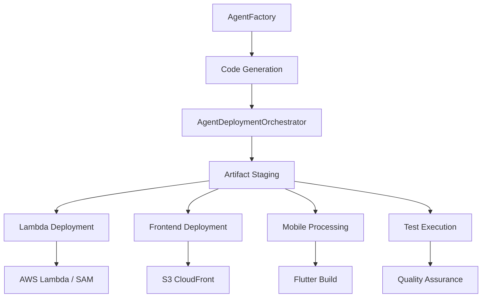

# Seawater Agent Deployment Orchestrator Integration

**Status:** ✅ Implemented  
**Date:** August 21, 2025  
**Integration Source:** Tim-Combo AgentDeploymentOrchestrator

## 🎯 Overview

The AgentDeploymentOrchestrator completes Seawater's autonomous development capabilities by providing automated deployment for agent-generated code. This bridges the gap between code generation (AgentFactory) and production deployment.

## 🔧 Key Components

### 1. AgentDeploymentOrchestrator (`src/agents/AgentDeploymentOrchestrator.js`)
- **Purpose**: Orchestrates deployment of generated agents and artifacts
- **Adaptations**: Seawater-specific AWS accounts and climate platform patterns
- **Features**: Multi-stage deployment pipeline with comprehensive error handling

### 2. Agent Deployment Script (`scripts/deploy-agents.js`)
- **Purpose**: CLI interface for agent generation and deployment
- **Integration**: Connects AgentFactory with AgentDeploymentOrchestrator
- **Modes**: Full, dev, generate-only, deploy-only

### 3. NPM Scripts (Updated `package.json`)
```bash
npm run deploy-agents          # Full generation and deployment
npm run deploy-agents:dev      # Quick dev deployment
npm run deploy-agents:generate # Generate agents only
npm run deploy-agents:deploy   # Deploy existing artifacts
```

## 🏗️ Architecture Integration



## 🌊 Seawater-Specific Adaptations

### AWS Account Configuration
```javascript
awsProfiles: {
  dev: 'dev-sso',      // Account: 532595801838
  media: 'media-sso'   // Account: 855652006097
}

buckets: {
  lambda: 'seawater-dev-lambda-532595801838',
  frontend: 'seawater-dev-fe-live-855652006097',
  media: 'seawater-media-live-855652006097'
}
```

### Climate Platform Features
- **Multi-region coordination** for global climate data
- **Mobile app integration** with Flutter build pipeline
- **Real-time monitoring** deployment patterns
- **Climate data processing** infrastructure automation

### Deployment Stages
1. **Climate Infrastructure** - SAM template deployment
2. **Lambda Handlers** - Climate data processors and API endpoints
3. **Frontend Components** - React components with climate UI
4. **Mobile Application** - Flutter app build and validation
5. **Quality Assurance** - Comprehensive testing pipeline

## 📱 Mobile Integration

The orchestrator includes Flutter-specific deployment capabilities:

```javascript
async deployMobile(mobileFiles) {
  // Flutter analysis and testing
  execSync('flutter analyze --no-fatal-infos');
  execSync('flutter test');
  
  // Build mobile artifacts
  execSync('flutter build apk --debug');
}
```

## 🚀 Usage Examples

### Full Deployment Pipeline
```bash
npm run deploy-agents
```
Generates comprehensive climate platform agents and deploys:
- Risk assessment handlers
- Data integration processors  
- Mobile app components
- Real-time monitoring systems

### Development Iteration
```bash
npm run deploy-agents:dev
```
Quick deployment for development changes:
- Minimal agent generation
- Fast handler deployment
- Frontend component updates

### Generation Only
```bash
npm run deploy-agents:generate
```
Generate agents without deployment:
- Code generation testing
- Artifact inspection
- Development planning

## 🔍 Quality Assurance Integration

The orchestrator includes comprehensive testing:

```javascript
async runTests(tests) {
  // Jest unit tests
  execSync('npm test -- --passWithNoTests');
  
  // Playwright E2E tests
  execSync('npx playwright test --reporter=line');
  
  // Flutter mobile tests
  execSync('flutter test');
}
```

## 🌍 Climate Data Processing

Special handling for climate platform requirements:

```javascript
async deployClimateInfrastructure(artifacts) {
  // SAM infrastructure deployment
  execSync('sam build');
  execSync('sam deploy --profile dev-sso');
  
  // Climate data processor validation
  // Multi-region coordination setup
}
```

## 📊 Deployment Monitoring

The orchestrator provides detailed deployment feedback:

```
🎯 Starting Seawater climate platform deployment pipeline...

📊 Stage 1: Climate Infrastructure
☁️ Deploying SAM infrastructure...
✅ Climate infrastructure deployed successfully

🚀 Stage 2: Lambda Handlers  
📦 Building SAM application for climate-risk-handler...
✅ Deployed climate-risk-handler successfully

⚛️ Stage 3: Frontend Components
🔍 Running TypeScript compilation check...
🏗️ Building frontend for production...
☁️ Deploying to S3 CloudFront...
✅ Frontend deployed successfully

📱 Stage 4: Mobile Application
🔍 Running Flutter analysis...
🧪 Running Flutter tests...
🤖 Building Android APK...
✅ Mobile app build completed successfully

🧪 Stage 5: Quality Assurance
⚡ Running unit tests...
🎭 Running E2E tests...
📱 Running mobile tests...
✅ All tests passed - climate platform validated

🎉 Seawater climate platform deployment completed successfully!

📋 Deployment Summary:
   • Handlers: 8 deployed
   • Components: 15 deployed  
   • Mobile files: 23 processed
   • Tests: 45 executed
```

## 🔗 Integration Benefits

### For Development Team
- **Autonomous deployment** from code generation to production
- **Multi-platform coordination** (web, mobile, backend)
- **Quality assurance automation** with comprehensive testing
- **Climate-specific patterns** optimized for data processing

### For Operations
- **Standardized deployment** following Tim-Combo patterns
- **Error handling and recovery** with detailed troubleshooting
- **Multi-account coordination** for dev/staging/production
- **Infrastructure as code** with SAM integration

### For Product Development
- **Faster iteration cycles** with automated deployment
- **Consistent environments** across development stages
- **Mobile-first deployment** supporting app store workflows
- **Climate data pipeline** automation for real-time processing

## 🎉 Completion Status

✅ **AgentDeploymentOrchestrator** - Implemented and adapted for Seawater  
✅ **Integration Scripts** - CLI interface and NPM commands ready  
✅ **Mobile Support** - Flutter build pipeline integrated  
✅ **Climate Patterns** - Multi-region and data processing support  
✅ **Quality Assurance** - Comprehensive testing automation  

The Seawater Climate Risk Platform now has complete autonomous development capabilities, matching and extending the Tim-Combo deployment orchestration patterns for climate-specific requirements.

---

**Next Steps**: Test the deployment pipeline with generated agents and refine climate-specific deployment patterns based on production usage.