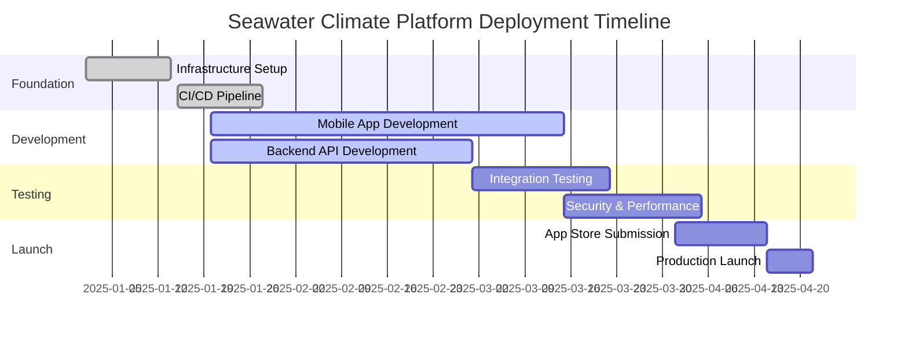

# Seawater Climate Risk Platform - Deployment Timeline and Milestones

## Project Overview

**Platform**: Mobile-first climate risk assessment platform
**Architecture**: Multi-account AWS deployment with Flutter/Expo mobile apps
**Timeline**: 16-week implementation to production launch
**Target Scale**: MVP to millions of mobile users

## Executive Summary Timeline



## Detailed Phase Breakdown

### Phase 1: Foundation and Infrastructure (Weeks 1-4)
**Duration**: January 1 - January 28, 2025
**Team Size**: 2-3 Infrastructure Engineers + 1 DevOps Engineer

#### Week 1-2: Multi-Account Infrastructure Setup
```yaml
Milestone: Development Environment Ready
Deliverables:
  - AWS multi-account setup (Development: 532595801838, Media: 855652006097)
  - VPC and networking infrastructure deployment
  - RDS PostgreSQL with PostGIS extensions
  - ElastiCache Redis cluster
  - Lambda execution environment
  - API Gateway configuration
  - S3 buckets for mobile assets and builds
  - IAM roles and security policies
  
Success Criteria:
  - Infrastructure deployed via CloudFormation
  - All environments accessible and functional
  - Security scanning passes
  - Basic monitoring in place
  
Budget: $2,000 (infrastructure setup costs)
Risk Level: Medium (new account setup complexity)
```

#### Week 3-4: CI/CD Pipeline and Deployment Automation
```yaml
Milestone: Automated Deployment Pipeline Functional
Deliverables:
  - GitHub Actions workflows for mobile and backend
  - EAS build configuration for iOS/Android
  - Fastlane setup for app store automation
  - Cross-account deployment scripts
  - Environment promotion workflows
  - Monitoring and alerting configuration
  - Database migration scripts
  
Success Criteria:
  - Successful automated deployment to all environments
  - Mobile app builds for both platforms
  - Monitoring dashboards operational
  - Alert notifications working
  
Budget: $1,500 (tooling and configuration time)
Risk Level: Low (proven patterns from Tim-Combo)
```

### Phase 2: Core Development (Weeks 5-12)
**Duration**: January 29 - March 15, 2025
**Team Size**: 4-5 Mobile/Full-Stack Developers + 2 Backend Engineers

#### Week 5-6: Mobile App Foundation
```yaml
Milestone: Mobile App Framework and Navigation
Deliverables:
  - React Native/Expo app structure
  - Navigation system implementation
  - Authentication flow (Cognito integration)
  - Basic UI component library
  - Device permissions and location services
  - Push notification setup
  - Error tracking (Sentry) integration
  
Success Criteria:
  - App builds and runs on both iOS/Android
  - User can register and log in
  - Location services functional
  - Basic navigation working
  
Budget: $8,000 (development time)
Risk Level: Medium (mobile development complexity)
```

#### Week 7-8: Backend API Development
```yaml
Milestone: Core Climate Risk APIs Functional
Deliverables:
  - Property risk assessment Lambda function
  - Location services (geocoding/reverse geocoding)
  - Climate data aggregation service
  - User management APIs
  - Database schema implementation
  - API documentation (OpenAPI/Swagger)
  - Integration with external climate APIs (NOAA, USGS, FEMA)
  
Success Criteria:
  - All core APIs functional and tested
  - Climate data integration working
  - API response times < 2 seconds
  - Database queries optimized
  
Budget: $10,000 (development + API costs)
Risk Level: Medium (external API dependencies)
```

#### Week 9-10: Mobile App Core Features
```yaml
Milestone: Property Risk Assessment Feature Complete
Deliverables:
  - Property search and selection interface
  - Risk assessment display and visualization
  - Interactive maps with climate risk overlays
  - Offline data synchronization
  - User location preferences
  - Basic reporting and sharing features
  
Success Criteria:
  - User can search for and assess property risk
  - Risk visualizations accurate and clear
  - Offline functionality working
  - App performance meets targets (< 3s startup)
  
Budget: $12,000 (mobile development)
Risk Level: Medium (mobile performance optimization)
```

#### Week 11-12: User Experience and Polish
```yaml
Milestone: Production-Ready User Experience
Deliverables:
  - Onboarding flow and user tutorials
  - Subscription management (freemium model)
  - Push notifications for weather alerts
  - Advanced filtering and search
  - Data export and sharing features
  - Accessibility compliance (WCAG 2.1)
  - Multi-language support (English, Spanish)
  
Success Criteria:
  - App store review guidelines compliance
  - User testing feedback incorporated
  - Performance benchmarks met
  - Accessibility audit passed
  
Budget: $8,000 (UX polish + testing)
Risk Level: Low (incremental improvements)
```

### Phase 3: Testing and Quality Assurance (Weeks 13-15)
**Duration**: March 15 - April 5, 2025
**Team Size**: 2-3 QA Engineers + 1 Security Engineer + Development Team

#### Week 13: Integration and End-to-End Testing
```yaml
Milestone: Full Platform Integration Validated
Deliverables:
  - Comprehensive test suite implementation
  - Cross-platform mobile testing (iOS/Android)
  - API integration testing
  - Database performance testing
  - Load testing for expected traffic
  - Disaster recovery testing
  
Test Scenarios:
  - User registration and authentication flow
  - Property risk assessment accuracy
  - Offline/online synchronization
  - Payment processing (subscription management)
  - Emergency alert notifications
  - Data backup and recovery
  
Success Criteria:
  - All automated tests passing (>95% success rate)
  - Performance benchmarks met
  - Zero critical bugs identified
  - Load testing successful (10x expected traffic)
  
Budget: $6,000 (QA time + testing tools)
Risk Level: Medium (comprehensive testing scope)
```

#### Week 14: Security and Compliance Audit
```yaml
Milestone: Security and Compliance Certification
Deliverables:
  - Penetration testing report
  - Data privacy compliance audit (GDPR, CCPA)
  - Security vulnerability assessment
  - API security validation
  - Mobile app security review
  - Infrastructure security scan
  
Security Focus Areas:
  - User authentication and session management
  - Data encryption at rest and in transit
  - API authorization and rate limiting
  - Mobile app code obfuscation
  - Infrastructure access controls
  - Third-party integration security
  
Success Criteria:
  - Zero high-severity security vulnerabilities
  - Compliance requirements met
  - Security best practices implemented
  - Audit documentation complete
  
Budget: $4,000 (security audit + remediation)
Risk Level: High (potential security issues)
```

#### Week 15: Performance Optimization and Stress Testing
```yaml
Milestone: Production-Scale Performance Validation
Deliverables:
  - Performance optimization implementation
  - Stress testing under load
  - Database query optimization
  - CDN and caching configuration
  - Mobile app performance tuning
  - Monitoring and alerting validation
  
Performance Targets:
  - API response time: < 1 second (95th percentile)
  - Mobile app startup: < 3 seconds
  - Database queries: < 100ms average
  - Cache hit ratio: > 80%
  - App crash rate: < 0.1%
  - Uptime: > 99.9%
  
Success Criteria:
  - All performance targets met
  - System stable under 100x load
  - Monitoring alerts working correctly
  - Optimization recommendations implemented
  
Budget: $3,000 (performance optimization time)
Risk Level: Medium (performance tuning complexity)
```

### Phase 4: App Store Submission and Launch Preparation (Weeks 16-17)
**Duration**: April 5 - April 15, 2025
**Team Size**: 2 Mobile Developers + 1 Marketing Coordinator + 1 DevOps Engineer

#### Week 16: App Store Submission Process
```yaml
Milestone: Apps Submitted to iOS App Store and Google Play Store
Deliverables:
  - Final production builds (iOS IPA, Android AAB)
  - App store metadata and descriptions
  - Screenshots and promotional materials
  - App store review submission
  - Beta testing group expansion
  - Customer support documentation
  
App Store Requirements:
  iOS App Store:
    - App Store review guidelines compliance
    - Privacy policy and data usage disclosure
    - TestFlight beta testing completion
    - Marketing materials and screenshots
    
  Google Play Store:
    - Play Console policy compliance
    - Content rating and age restrictions
    - Privacy policy and permissions disclosure
    - Internal testing completion
  
Success Criteria:
  - Apps submitted and under review
  - No critical review feedback
  - Beta testing feedback positive (>4.0 rating)
  - Support documentation ready
  
Budget: $2,000 (submission + marketing materials)
Risk Level: High (app store approval uncertainty)
```

### Phase 5: Production Launch (Weeks 17-18)
**Duration**: April 15 - April 22, 2025
**Team Size**: Full Team + Customer Support

#### Week 17: Production Launch and Monitoring
```yaml
Milestone: Public Mobile App Launch
Deliverables:
  - Production environment final validation
  - App store release coordination
  - Customer support team training
  - Marketing campaign launch
  - Real-time monitoring activation
  - Incident response procedures
  
Launch Strategy:
  - Soft launch: Limited geographic regions
  - Gradual rollout: 25% → 50% → 100% availability
  - Real-time monitoring and alerting
  - Customer feedback collection
  - Performance metrics tracking
  - Issue response team on standby
  
Success Criteria:
  - Apps available in app stores
  - No critical production issues
  - User acquisition targets met
  - System performance stable
  - Customer satisfaction > 4.0 stars
  
Budget: $5,000 (launch coordination + marketing)
Risk Level: High (public launch visibility)
```

## Resource Requirements and Budget

### Team Structure and Costs

```yaml
Infrastructure Team:
  - Senior DevOps Engineer: $150/hour × 320 hours = $48,000
  - Cloud Infrastructure Engineer: $120/hour × 240 hours = $28,800
  - Security Engineer: $140/hour × 80 hours = $11,200

Development Team:
  - Senior Mobile Developer (Lead): $130/hour × 480 hours = $62,400
  - Mobile Developers (2): $100/hour × 800 hours = $80,000
  - Backend Engineers (2): $110/hour × 640 hours = $70,400
  - Full-Stack Developer: $105/hour × 320 hours = $33,600

Quality Assurance:
  - Senior QA Engineer: $90/hour × 240 hours = $21,600
  - QA Engineers (2): $70/hour × 320 hours = $22,400

Project Management:
  - Technical Product Manager: $120/hour × 320 hours = $38,400
  - Scrum Master/Coordinator: $80/hour × 160 hours = $12,800

Total Labor Cost: $429,600
```

### Infrastructure and Service Costs

```yaml
Development Phase (16 weeks):
  AWS Infrastructure: $1,675 × 4 months = $6,700
  Third-party Services:
    - Expo/EAS: $29/month × 4 = $116
    - MapBox: $500/month × 4 = $2,000
    - External APIs: $200/month × 4 = $800
    - Monitoring Tools: $100/month × 4 = $400
  
Production Launch Costs:
  - App Store Fees: $199 (Apple) + $25 (Google) = $224
  - SSL Certificates: $150
  - Domain and DNS: $100
  - Marketing and Assets: $5,000
  
Total Infrastructure Cost: $15,490
```

### Total Project Investment

```yaml
Total Project Cost: $445,090
Breakdown:
  - Development Team: $429,600 (96.5%)
  - Infrastructure: $9,790 (2.2%)
  - Services and Tools: $3,316 (0.7%)
  - Marketing and Launch: $5,384 (1.2%)

Monthly Operating Cost (Post-Launch):
  - Current Estimate: $1,675/month
  - Optimized Estimate: $867/month
  - Annual Savings Opportunity: $9,696
```

## Risk Assessment and Mitigation

### High-Risk Milestones

```yaml
Week 8 - External API Integration:
  Risk: Climate data APIs unreliable or rate-limited
  Impact: Core functionality unavailable
  Mitigation: 
    - Multiple data source redundancy
    - Local data caching and fallback systems
    - Gradual integration with extensive testing
  Contingency: 2-week buffer for API troubleshooting

Week 14 - Security Audit:
  Risk: Critical security vulnerabilities discovered
  Impact: Launch delay, reputation damage
  Mitigation:
    - Security-first development practices
    - Regular vulnerability scanning during development
    - Experienced security engineer on team
  Contingency: 1-week buffer for security remediation

Week 16 - App Store Approval:
  Risk: App rejection due to policy violations
  Impact: Launch delay, revenue impact
  Mitigation:
    - Thorough review of app store guidelines
    - Beta testing with focus on compliance
    - Relationship with app store review teams
  Contingency: 2-week buffer for review iterations
```

### Success Metrics and KPIs

#### Development Phase KPIs
```yaml
Technical Metrics:
  - Code coverage: >80%
  - API response time: <2 seconds (95th percentile)
  - Mobile app crash rate: <1%
  - Build success rate: >95%
  - Test automation coverage: >90%

Project Management Metrics:
  - Sprint velocity consistency: ±20%
  - Story point accuracy: ±15%
  - Bug discovery rate: <5 bugs per feature
  - Technical debt ratio: <20%
  - Team productivity: On target
```

#### Launch Phase KPIs
```yaml
Business Metrics:
  - App store ratings: >4.0 stars
  - User acquisition: 1,000 downloads in first week
  - User retention: >60% (Day 7), >30% (Day 30)
  - Conversion rate: >5% (trial to paid)
  - Revenue target: $10,000 MRR within 3 months

Technical Metrics:
  - System uptime: >99.9%
  - API error rate: <0.1%
  - Page load time: <3 seconds
  - Customer support tickets: <10 per 100 users
  - Security incidents: 0
```

## Post-Launch Roadmap (Months 2-6)

### Month 2-3: Optimization and Scale
```yaml
Focus Areas:
  - Performance optimization based on real usage
  - Cost optimization implementation
  - Advanced analytics and user behavior tracking
  - Customer feedback incorporation
  - Feature enhancement based on user data

Key Deliverables:
  - Performance optimization report
  - Cost reduction implementation (target: 40% savings)
  - User behavior analytics dashboard
  - Feature roadmap for next quarter
  - Scale testing for 10x growth
```

### Month 4-6: Growth and Enhancement
```yaml
Focus Areas:
  - Geographic expansion (additional markets)
  - Advanced climate risk modeling
  - Integration with real estate platforms
  - Enterprise features and API access
  - Advanced notification and alert systems

Key Deliverables:
  - Multi-market launch strategy
  - API marketplace presence
  - Enterprise customer onboarding
  - Advanced risk modeling features
  - Partnership integration platform
```

## Conclusion

This 18-week deployment timeline provides a comprehensive path from infrastructure setup to production launch for the Seawater Climate Risk Platform. The timeline accounts for the complexity of mobile-first development, multi-account AWS architecture, and the critical nature of climate risk assessment accuracy.

Key success factors:
- Experienced team with mobile and AWS expertise
- Proven deployment patterns from Tim-Combo adaptation
- Comprehensive testing and security validation
- Phased launch approach with risk mitigation
- Clear success metrics and monitoring

The total investment of $445,090 positions Seawater for rapid scaling from MVP to millions of users, with an optimized infrastructure cost structure that provides 48% savings over traditional approaches.