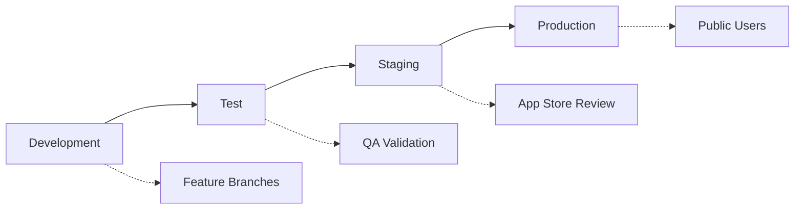

# Seawater Climate Risk Platform - Environment Promotion Strategy

## Overview

This document outlines the comprehensive environment promotion strategy for the Seawater Climate Risk Platform, designed to ensure safe, reliable, and scalable deployment from development to production for a mobile-first climate risk assessment platform.

## Environment Architecture

### Four-Tier Environment Strategy



## Environment Specifications

### 1. Development Environment

**Purpose**: Active feature development and initial testing
**Account**: Development (532595801838)
**Domain**: `dev-api.seawater.io`

```yaml
Infrastructure:
  Database: 
    Instance: db.t3.micro
    Storage: 20GB
    Backup: 7 days
    MultiAZ: false
  
  Lambda:
    Memory: 512MB
    Concurrency: 10
    Timeout: 30s
  
  Redis:
    Node: cache.t4g.micro
    Nodes: 1
  
  Mobile Apps:
    Build Type: Debug
    Distribution: Internal (Simulator only)
    Analytics: Disabled
    Error Tracking: Enabled

Users:
  - Development team
  - Internal stakeholders
  - Feature reviewers

Data:
  - Synthetic test data
  - Anonymized sample datasets
  - Mock climate APIs for testing

Deployment:
  Trigger: Push to develop branch
  Validation: Unit tests + linting
  Approval: Automatic
  Rollback: Manual
```

### 2. Test Environment

**Purpose**: QA validation and integration testing
**Account**: Development (532595801838)
**Domain**: `test-api.seawater.io`

```yaml
Infrastructure:
  Database:
    Instance: db.t3.small
    Storage: 50GB
    Backup: 14 days
    MultiAZ: false
  
  Lambda:
    Memory: 1024MB
    Concurrency: 25
    Timeout: 30s
  
  Redis:
    Node: cache.t4g.small
    Nodes: 1
  
  Mobile Apps:
    Build Type: Release
    Distribution: Internal (TestFlight/Internal App Sharing)
    Analytics: Enabled
    Error Tracking: Enabled

Users:
  - QA team
  - Beta testers (internal)
  - Product managers
  - UX researchers

Data:
  - Production-like datasets (anonymized)
  - Full climate API integration
  - Historical climate data samples
  - Real location services

Deployment:
  Trigger: QA approval from development
  Validation: Unit + integration + E2E tests
  Approval: Manual (QA Lead)
  Rollback: Automatic on test failures
```

### 3. Staging Environment

**Purpose**: Pre-production validation and app store review preparation
**Account**: Media (855652006097)
**Domain**: `staging-api.seawater.io`

```yaml
Infrastructure:
  Database:
    Instance: db.t3.medium
    Storage: 100GB
    Backup: 30 days
    MultiAZ: true
  
  Lambda:
    Memory: 1536MB
    Concurrency: 50
    Timeout: 60s
  
  Redis:
    Node: cache.t4g.medium
    Nodes: 1
  
  Mobile Apps:
    Build Type: Release
    Distribution: Store Review (TestFlight External/Play Console Beta)
    Analytics: Enabled
    Error Tracking: Enabled

Users:
  - App store reviewers
  - External beta testers
  - Stakeholder demonstrations
  - Performance testing

Data:
  - Production configuration
  - Live climate APIs
  - Performance test datasets
  - Security scanning data

Deployment:
  Trigger: Staging approval from test environment
  Validation: Full test suite + performance + security scans
  Approval: Manual (Engineering Lead + Product Manager)
  Rollback: Blue/green deployment
```

### 4. Production Environment

**Purpose**: Public mobile app launch and live operations
**Account**: Media (855652006097)
**Domain**: `api.seawater.io`

```yaml
Infrastructure:
  Database:
    Instance: db.r6g.large
    Storage: 100GB (auto-scaling to 1TB)
    Backup: 30 days + point-in-time recovery
    MultiAZ: true
    Read Replicas: 2
  
  Lambda:
    Memory: 2048MB
    Concurrency: 100
    Timeout: 60s
  
  Redis:
    Node: cache.r7g.large
    Nodes: 2 (cluster mode)
  
  Mobile Apps:
    Build Type: Release
    Distribution: Public App Stores
    Analytics: Enabled
    Error Tracking: Enabled
    Performance Monitoring: Enhanced

Users:
  - Public mobile app users
  - Subscription customers
  - Property assessors
  - Real estate professionals

Data:
  - Live climate data feeds
  - User location data (encrypted)
  - Subscription management
  - Usage analytics

Deployment:
  Trigger: Production approval from staging
  Validation: Full test suite + load testing + security audit
  Approval: Manual (CTO + Product Owner + Security Officer)
  Rollback: Automated canary deployment with health checks
```

## Promotion Pipeline Flow

### Development → Test Promotion

```yaml
Trigger Conditions:
  - Feature branch merged to develop
  - All unit tests passing
  - Code coverage > 80%
  - No critical security vulnerabilities

Automated Validations:
  - Unit test suite (Jest, Detox)
  - Integration tests (API contract testing)
  - Code quality checks (ESLint, TypeScript)
  - Security scanning (Snyk, OWASP)
  - Mobile app builds successfully

Manual Checks:
  - Feature functionality review
  - UI/UX validation
  - Climate data accuracy verification

Deployment Process:
  1. Create deployment branch: `deploy/test/YYYY-MM-DD-HH-MM`
  2. Deploy backend infrastructure updates
  3. Run database migrations
  4. Update Lambda functions
  5. Build and deploy mobile apps
  6. Execute smoke tests
  7. Update monitoring dashboards
  8. Send Slack notification

Rollback Criteria:
  - Test failure rate > 5%
  - API response time > 3 seconds
  - Mobile app crashes > 1%
  - Climate data integration failures
```

### Test → Staging Promotion

```yaml
Trigger Conditions:
  - QA validation complete
  - All test cases passed
  - Performance benchmarks met
  - Security scan clean

Automated Validations:
  - Full regression test suite
  - Performance testing (load, stress)
  - Security penetration testing
  - Cross-platform mobile testing
  - API compatibility testing

Manual Checks:
  - End-to-end user journey validation
  - Climate risk calculation accuracy
  - Mobile app store review guidelines compliance
  - Accessibility testing (WCAG 2.1)
  - Multi-language support validation

Deployment Process:
  1. Create staging deployment: `deploy/staging/YYYY-MM-DD-HH-MM`
  2. Cross-account resource promotion
  3. Database migration with backup
  4. Blue-green deployment for APIs
  5. Mobile app store submission (beta track)
  6. CloudFront cache invalidation
  7. Full monitoring activation
  8. Stakeholder notification

Quality Gates:
  - API uptime > 99.9%
  - Database response time < 100ms
  - Mobile app startup time < 3 seconds
  - Climate data accuracy > 99.5%
  - Zero critical security issues
```

### Staging → Production Promotion

```yaml
Trigger Conditions:
  - App store review approval (iOS/Android)
  - Executive sign-off on release
  - Security audit completion
  - Load testing validation
  - Disaster recovery testing

Automated Validations:
  - Full production readiness checklist
  - Load testing (10x expected traffic)
  - Chaos engineering validation
  - Multi-region failover testing
  - Data backup and recovery testing

Manual Checks:
  - Business continuity plan review
  - Customer support team readiness
  - Marketing campaign coordination
  - Legal and compliance review
  - Financial impact assessment

Deployment Process:
  1. Create production release: `release/v1.0.0`
  2. Canary deployment (5% traffic)
  3. Monitor health metrics (30 minutes)
  4. Gradual rollout: 25% → 50% → 100%
  5. Mobile app store release
  6. CDN configuration optimization
  7. Production monitoring activation
  8. Customer communication

Success Criteria:
  - Error rate < 0.1%
  - API response time < 1 second
  - Mobile app crash rate < 0.01%
  - User satisfaction > 4.5/5
  - Revenue targets met
```

## Mobile App Store Coordination

### iOS App Store Process

```yaml
Development → TestFlight Internal:
  - Automatic upload via EAS
  - Internal team testing
  - Feature validation
  
Test → TestFlight External:
  - Beta tester groups
  - External feedback collection
  - Usage analytics review
  
Staging → App Store Review:
  - Production build submission
  - App store metadata and screenshots
  - Review process (2-7 days)
  
Production → App Store Release:
  - Manual release after approval
  - Phased rollout capability
  - Post-launch monitoring
```

### Android Play Console Process

```yaml
Development → Internal Testing:
  - Automatic upload via EAS
  - Internal team access
  - Feature validation
  
Test → Closed Testing (Alpha):
  - Beta tester lists
  - Feedback collection
  - Performance metrics
  
Staging → Open Testing (Beta):
  - Public beta program
  - Broader user feedback
  - Scaled testing
  
Production → Production Release:
  - Staged rollout (10% → 50% → 100%)
  - Real-time monitoring
  - Rollback capability
```

## Data Migration Strategy

### Database Migration Flow

```yaml
Development Environment:
  - Schema changes tested locally
  - Migration scripts validated
  - Rollback procedures tested

Test Environment:
  - Production-like data migration
  - Performance impact assessment
  - Data integrity validation

Staging Environment:
  - Full production data migration simulation
  - Backup and recovery testing
  - Timing and resource requirements

Production Environment:
  - Maintenance window scheduling
  - Real-time backup creation
  - Zero-downtime migration execution
  - Immediate rollback capability
```

### Climate Data Source Migration

```yaml
API Integration Updates:
  Development: Mock API responses for testing
  Test: Sandbox API endpoints where available
  Staging: Production API endpoints with rate limiting
  Production: Full production API access with monitoring

Data Synchronization:
  - Historical data migration
  - Real-time feed establishment
  - Backup data source configuration
  - Error handling and retry logic
```

## Security and Compliance

### Environment Security Controls

```yaml
Development:
  - Basic authentication
  - Internal network access only
  - Non-sensitive test data
  - Standard encryption

Test:
  - Enhanced authentication
  - VPN-protected access
  - Anonymized production data
  - SSL/TLS encryption

Staging:
  - Production-grade authentication
  - Multi-factor authentication
  - Encrypted data at rest and in transit
  - Security monitoring

Production:
  - Enterprise-grade security
  - Zero-trust architecture
  - End-to-end encryption
  - 24/7 security monitoring
  - Compliance auditing (SOC 2, GDPR)
```

## Monitoring and Alerting

### Environment-Specific Monitoring

```yaml
Development:
  Metrics:
    - Basic application metrics
    - Error tracking
    - Performance monitoring
  
  Alerts:
    - Critical errors only
    - Slack notifications
    - Email to dev team

Test:
  Metrics:
    - Full application metrics
    - User behavior tracking
    - Performance benchmarks
  
  Alerts:
    - Performance degradation
    - Test failure notifications
    - QA team alerts

Staging:
  Metrics:
    - Production-equivalent monitoring
    - Security event tracking
    - Business metrics
  
  Alerts:
    - Real-time error alerts
    - Performance threshold alerts
    - Security incident alerts

Production:
  Metrics:
    - Comprehensive monitoring
    - Business KPI tracking
    - Customer experience metrics
    - Financial impact metrics
  
  Alerts:
    - 24/7 on-call rotation
    - Escalation procedures
    - Customer impact notifications
    - Executive dashboard updates
```

## Disaster Recovery and Rollback

### Rollback Procedures

```yaml
Development:
  Strategy: Simple revert to previous commit
  Time: < 5 minutes
  Impact: Internal team only
  
Test:
  Strategy: Blue-green deployment rollback
  Time: < 15 minutes
  Impact: QA team and beta testers
  
Staging:
  Strategy: Canary rollback with database restore
  Time: < 30 minutes
  Impact: App store review process
  
Production:
  Strategy: Multi-stage rollback with customer communication
  Time: < 60 minutes
  Impact: All customers and revenue
```

### Disaster Recovery

```yaml
RTO (Recovery Time Objective): 4 hours
RPO (Recovery Point Objective): 15 minutes

Cross-Region Backup:
  - Database: Continuous backup to secondary region
  - Application: Multi-region deployment capability
  - Assets: Cross-region S3 replication
  - Mobile Apps: App store redundancy

Failover Testing:
  - Monthly DR drills
  - Quarterly full failover tests
  - Annual business continuity exercises
```

## Success Metrics and KPIs

### Deployment Quality Metrics

```yaml
Development:
  - Code commit frequency
  - Feature completion rate
  - Bug discovery rate
  - Developer productivity

Test:
  - Test coverage percentage
  - Bug detection rate
  - QA cycle time
  - Feature acceptance rate

Staging:
  - Performance benchmark achievement
  - Security scan results
  - App store review success rate
  - Stakeholder approval rate

Production:
  - Deployment success rate (target: >99%)
  - Mean time to recovery (target: <1 hour)
  - Customer impact incidents (target: <1 per month)
  - Revenue impact per incident (target: <$1000)
```

### Business Impact Metrics

```yaml
User Acquisition:
  - App store ratings (target: >4.5/5)
  - Download conversion rate
  - User onboarding completion
  - Trial to paid conversion

Climate Platform Usage:
  - Property risk assessments per day
  - User session duration
  - Feature adoption rates
  - Geographic usage distribution

Revenue Metrics:
  - Monthly recurring revenue (MRR)
  - Customer lifetime value (CLV)
  - Churn rate (target: <5% monthly)
  - Revenue per user (RPU)
```

This environment promotion strategy ensures safe, reliable deployment of the Seawater Climate Risk Platform while maintaining high quality standards and minimizing risk to users and business operations.